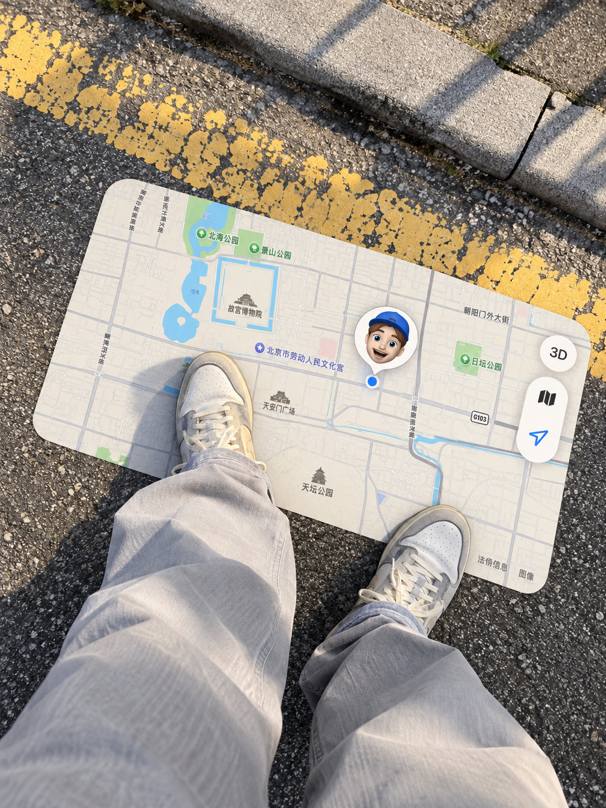

# 脚下地图拼贴

作者：**理智画** · [GitHub @liuzihe849-png](https://github.com/liuzihe849-png)

使用 `$ground-map-photo-weave`，把用户自己的照片制作成对应视觉效果。包内已附原创参考样片，执行时需读取参考与规则；用户无需重新提供同一张风格参考。



## 安装与使用

将本仓库整个文件夹放到你的 Skills 目录，保留 `SKILL.md`、`references/`、`assets/` 及存在的 `scripts/`，然后在新对话调用：

```text
$ground-map-photo-weave
上传我的原照片；提供：城市或地标；头像选择
```

也可让 Skill Installer 从 https://github.com/liuzihe849-png/ground-map-photo-weave 安装。运行所需图像工具必须在用户环境可用；本仓库不是独立生图模型或免费 API。

## 当前状态

2026-10-07 更新：以上样片由用户明确选为正确视觉目标。新增地图比例检查脚本、鞋缘放大检查、可见投影与接触阴影要求，并区分地图面板放大和真实地图拍摄视图的缩放。新照片仍须实际出图与人工审核，未声明稳定性或 Windows 实机已通过。

## 署名与素材

Skill 设计、流程整理和样片制作：**理智画**。参考样片是创作结果，不是新用户的身份来源。外网博主原始照片、私人对话、原始输入照片和临时文件未放入本次发布包。素材说明见 [CREDITS.md](CREDITS.md)，代码与文档许可见 [LICENSE](LICENSE)。
